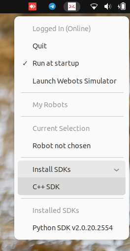
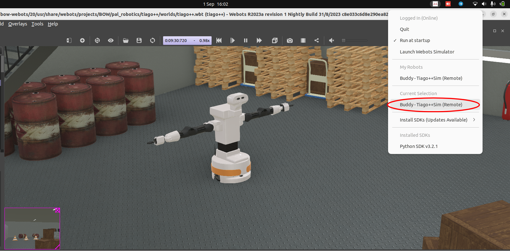
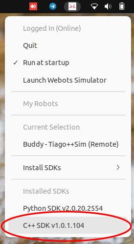
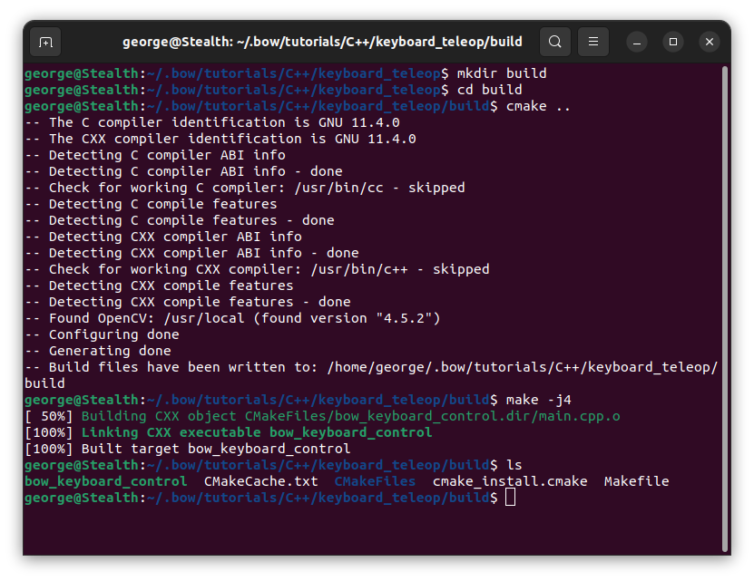
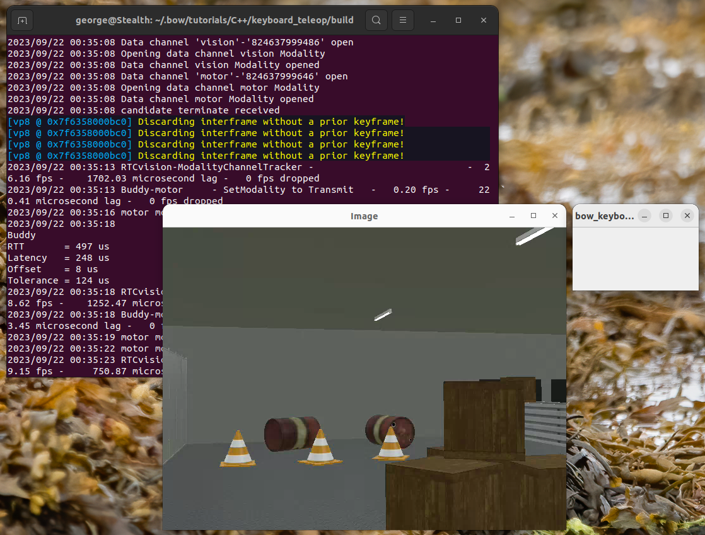
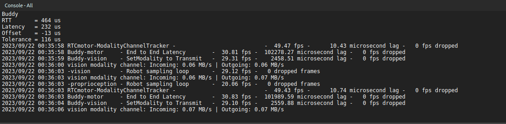

# Linux - Installing and using the BOW C++ SDK

This tutorial assumes you have already installed the BOW System Tray application and simulator on your workstation. If not, follow this [tutorial](https://github.com/bowltd/SDK-Tutorials/blob/main/Linux%20-%20Setting%20up%20your%20BOW%20developer%20environment.md) to get your environment set up.

### Installing the C++ SDK
1. The simplest way to install the BOW SDKs is using the Systray application. Simply click the "Install SDKs" drop down menu and then select "C++ SDK".



2. Follow the onscreen prompts and wait for the installation to complete, you may have to enter your password a few times.

### Testing with a simulated robot
Now lets run your first BOW enabled C++ program to control a simulated robot.

1. Let's start by running the simulator, this can either be launched from the systray, "Launch Webots Simulator", or by running the command `bow-webots` in a terminal.
2. In Webots, select `File -> Open Sample World`. In the menu that appears, navigate to `BOW -> pal_robotics -> tiago++ -> tiago++.wbt` and click OK.


3. Once the project opens the BOW driver will start running automatically, after a short moment the simulated Tiago++ robot, named Buddy, will appear in the BOW systray under the "My Robots" heading. Select this robot, and it will appear under the "Current Selection" heading. You are now connected to Buddy.



4. Before compiling we will need to install some additional tools and libraries. Open a terminal and run the following command:

```bash
sudo apt-get install qtbase5-dev pkg-config build-essential libopencv-dev
```
5. Now let's navigate to an example project, by clicking on the installed SDK in the systray you will be taken to the tutorials directory (Home/.bow/tutorials/C++).



6. For this example we will use the Keyboard Control project, open the "keyboard_teleop" directory.
7. Within this directory, there is an install.sh script which can be used to build the project using the command `./install.sh`. For the purposes of this tutorial however we will run through the steps in full.
8. Let start by generating the Makefiles using cmake. First create a directory named build, navigate to this directory and run cmake

```bash
mkdir build
cd build
cmake ..
```

9. Now we can make the executable

```bash
make -j4
```

10. If the compilation was successful, you will now have an executable file named `bow_keyboard_control` 



11. Now lets run the example program, and test it works with our simulated robot

```bash
./bow_keyboard_control
```

12. After a short wait, you will see a window open which displays the image stream from the camera of the Tiago++. You will also see some activity in the console of the Webots sim which indicates that the connection to the robot has been made.




7. Try controlling the robot using your keyboard. First select the empty window titled "bow_keyboard_control". W, A, S and D keys control forwards, backwards and rotate, Q and E control strafing, the arrow keys control head movements.
8. That's it, you have now tested your first BOW enabled robot using the C++ SDK.

### Experiment
Why not take this test further, your robot doesn't need to be on the same local network as your C++ program. Why not run the simulated robot on one workstation and run the keyboard controller from another workstation on a different network to experience simulated telepresence!
