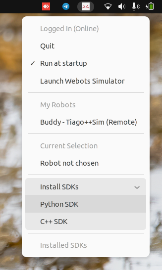
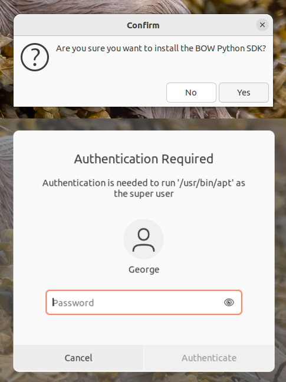
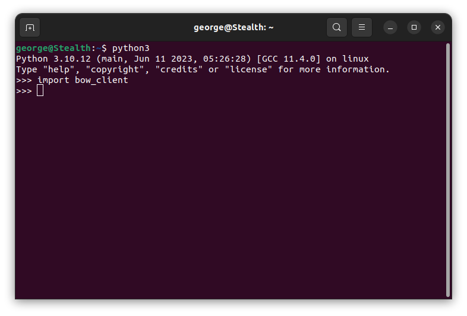
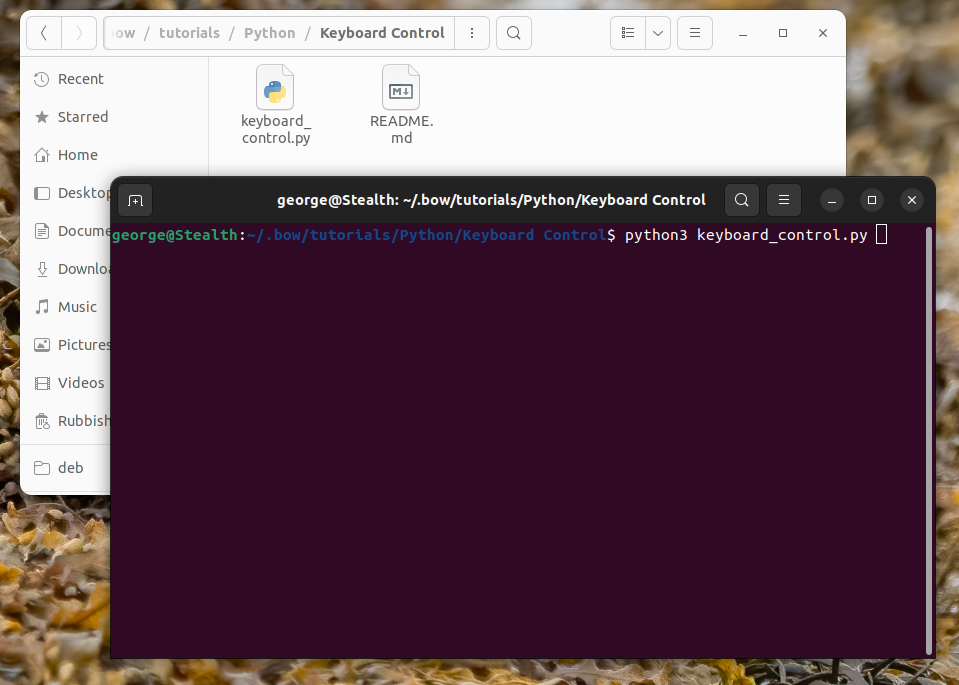
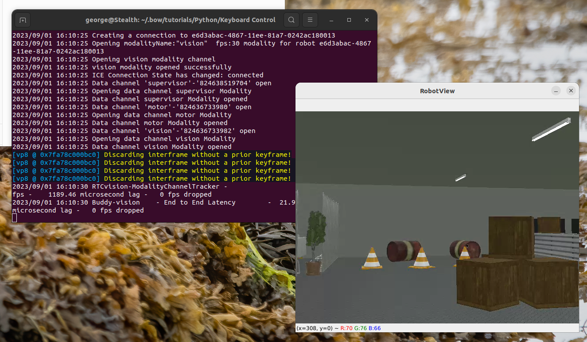
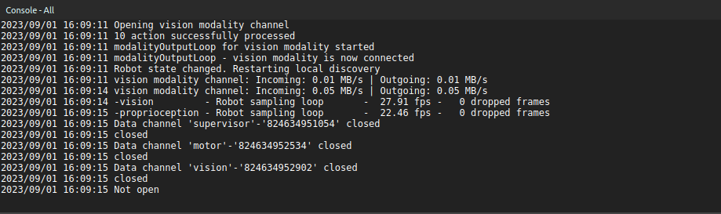

# Linux - Installing and using the BOW Python SDK

This tutorial assumes you have already installed the BOW System Tray application and simulator on your workstation. If not, follow this [tutorial](https://github.com/bowltd/SDK-Tutorials/blob/main/Linux%20-%20Setting%20up%20your%20BOW%20developer%20environment.md) to get your environment set up.

### Installing the Python SDK
1. The simplest way to install the BOW SDKs is using the Systray application. Simply click the "Install SDKs" drop down menu and then select "Python SDK".



2. Follow the onscreen prompts and wait for the installation to complete.




3. To test the installation we can open a Python 3 terminal and import the newly installed package.
```bash
python3
```
```bash
import bow_client
```



4. If there are no errors as a result of this command then we know the package installed successfully, and you are ready develop!

### Testing with a simulated robot
Now lets run your first BOW enabled Python program to control a simulated robot.

1. Let's start by running the simulator, this can either be launched from the systray, "Launch Webots Simulator", or by running the command `bow-webots` in a terminal.
2. In Webots, select `File -> Open Sample World`. In the menu that appears, navigate to `BOW -> pal_robotics -> tiago++ -> tiago++.wbt` and click OK.


3. Once the project opens the BOW driver will start running automatically, after a short moment the simulated Tiago++ robot, named Buddy, will appear in the BOW systray under the "My Robots" heading. Select this robot, and it will appear under the "Current Selection" heading. You are now connected to Buddy.


4. Now let's navigate to an example project, by clicking on the installed SDK in the systray you will be taken to the tutorials directory (Home/.bow/tutorials/Python).
5. For this example we will use the Keyboard Control project, open the keyboard control directory and within a terminal run the command

```bash
python3 keyboard_control.py
```



6. You will see a window open which displays the image stream from the camera of the Tiago++. You will also see some activity in the console of the Webots sim which indicates that the connection to the robot has been made.




7. Try controlling the robot using your keyboard. W, A, S and D keys control forwards, backwards and rotate, Q and E control strafing, the arrow keys control head movements.
8. That's it, you have now tested your first BOW enabled robot using the Python SDK.

### Experiment
Why not take this test further, your robot doesn't need to be on the same local network as your Python program. Why not run the simulated robot on one workstation and run the keyboard controller from another workstation on a different network to experience simulated telepresence!
