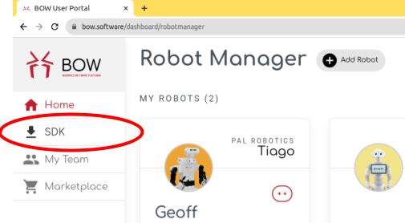
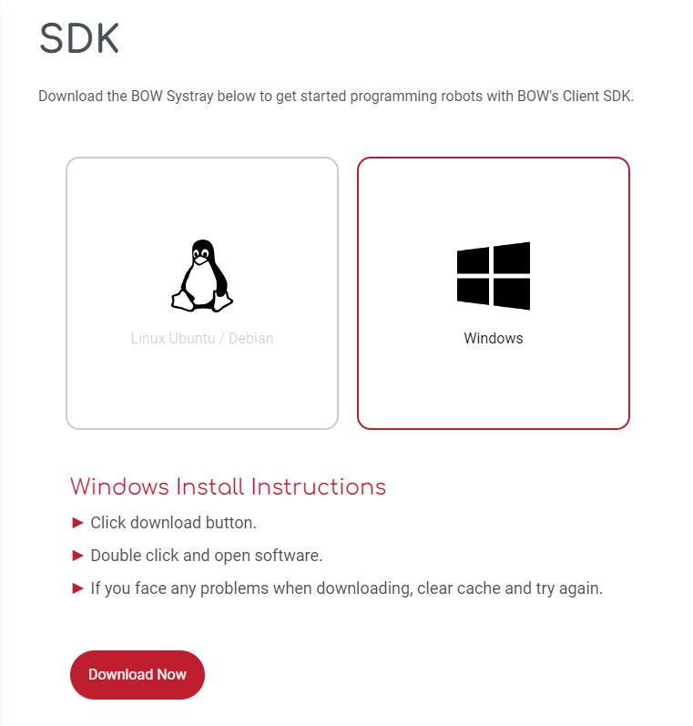
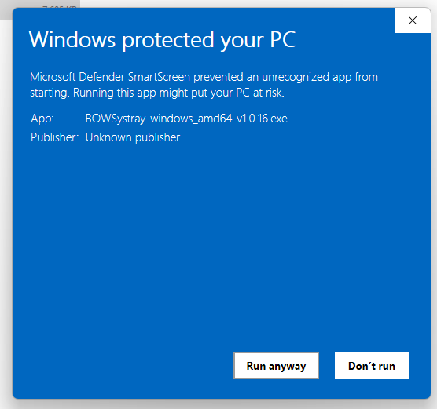
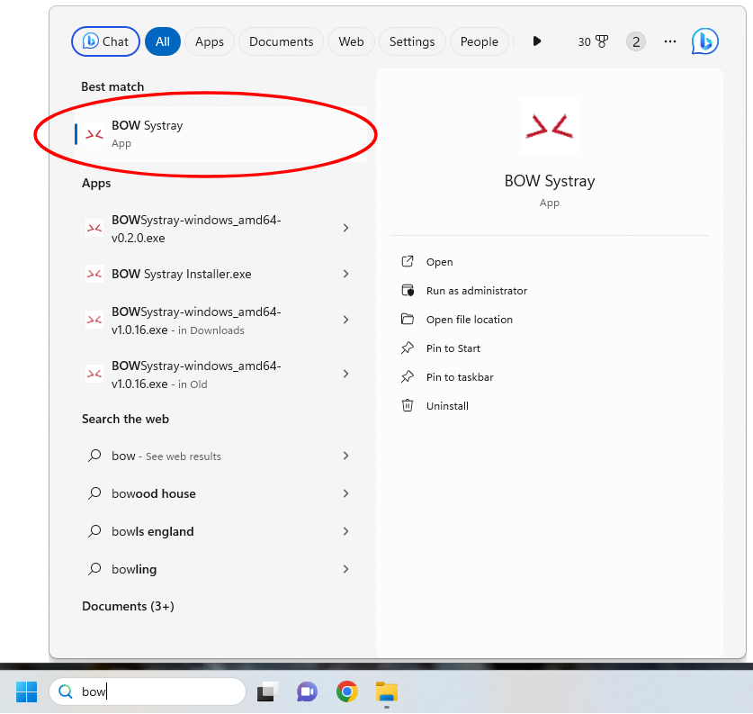
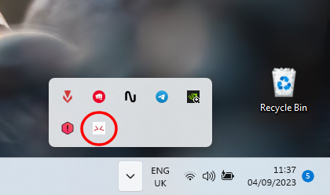
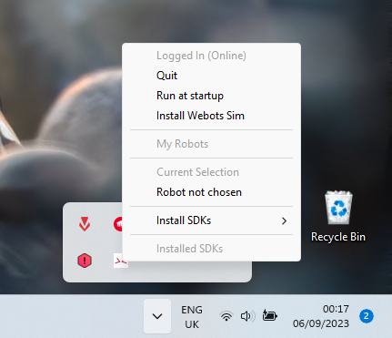
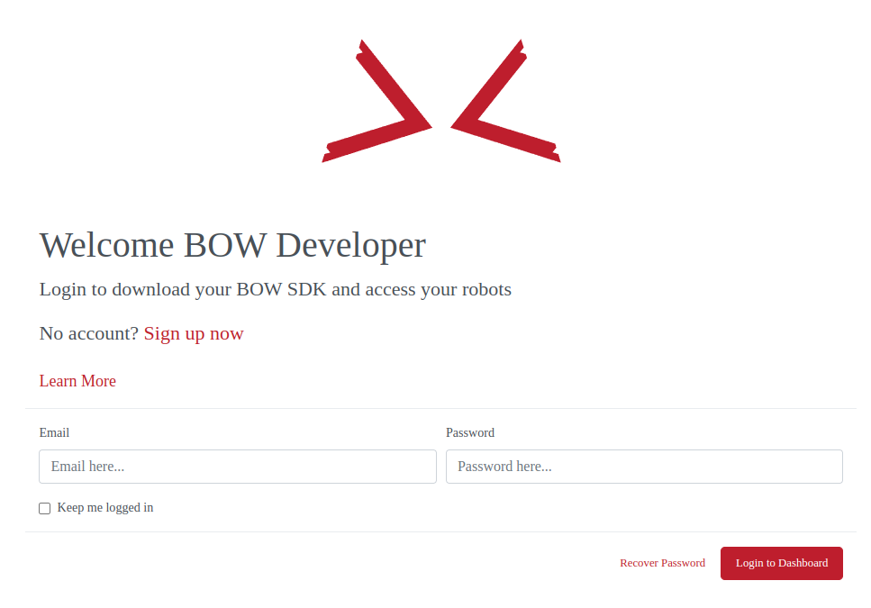
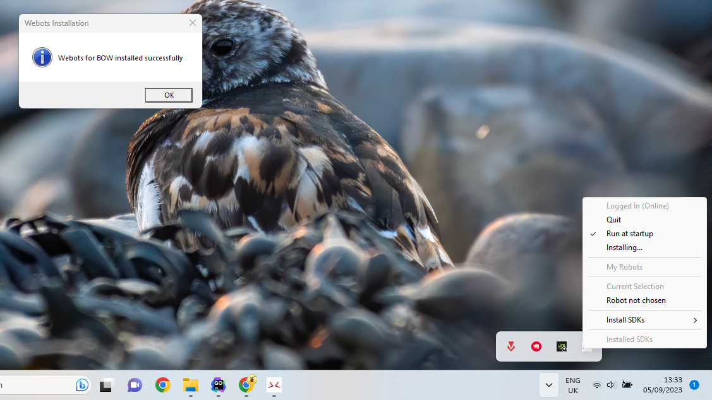
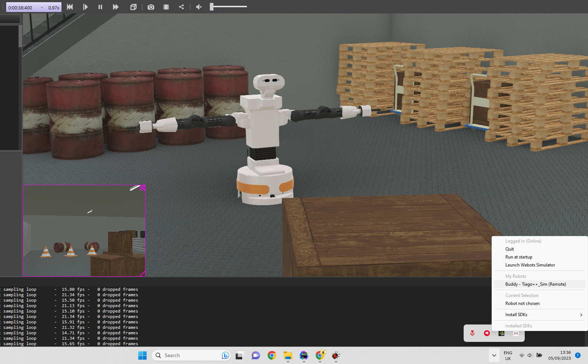

# Windows - Setting up your BOW developer environment

## The Systray

The first step in setting up BOW development on your Windows workstation is to install the System Tray Application. This application is not only where you can control which robots you are connected to but also provides shortcuts to installing the BOW SDKs and simulator.

### Download and Install

1. Visit [bow.software](https://bow.software) and login to access your dashboard. If you don't already have an account, now is the time to create one.
2. Once logged in, you will see the "SDK" menu item on the left-hand side; this will take you to our downloads page.

3. Select the "Windows" option and press the "Download Now" button.

4. Read and agree to the license agreement (there'll be a test) to begin the download of the `BOWSystray-windows_amd64-vX.X.XX.exe` installer file.
5. Once the download has completed, navigate to the directory where the installer is located (usually Downloads) and run it.
6. Follow the onscreen directions (last chance to read our license agreement!), you may have to give permissions to allow the installation with Windows defender or other antivirus software and grant admin privileges.

### Setup

1. To run the Systray, search for `BOW Systray` in the Start menu, and run the program.

2. The BOW Icon will appear in your system tray in the bottom right of your desktop (you may have to expand the system tray using the ^ button).

3. Click the Icon to reveal a drop-down menu; here you will see options to login, a list of your available robots, and options to install SDKs for various programming languages.

3. Now let's log in. Click the "Login" button, and you will be taken to a page where you can enter your BOW-associated email address and password to log in to your account. Once complete, you can close this browser window.

4. We recommend checking the "Run at startup" option; this means you can avoid having to start the program manually. The app is very lightweight and simply monitors the robots associated with your account to check if they are available.
5. Next, let's install the simulator. Click the "Install Webots Sim" button and follow any onscreen prompts. The button will change to read "Installing…". Wait for confirmation that the installation has completed; this could take quite a while as it downloads and installs the program.

### Test

1. Once installed, the button will change to read "Launch Webots Simulator." Click this button or launch webots from the start menu, and you will be presented with some setup steps for the Webots sim. Complete these to your liking.
2. Now let's open your first BOW-enabled (simulated) robot. In Webots, select `File -> Open Sample World`.

3. In the menu that appears, navigate to `BOW -> pal_robotics -> tiago++ -> tiago++.wbt` and click OK.
4. That's it; your simulated Tiago++ is up and running the BOW driver. The robot will now appear in the "My Robots" section of the BOW Systray menu and in your dashboard on the BOW user portal.

6. Make robot go brrrrrrrrr……….. (Check out our other tutorials for how to do this)